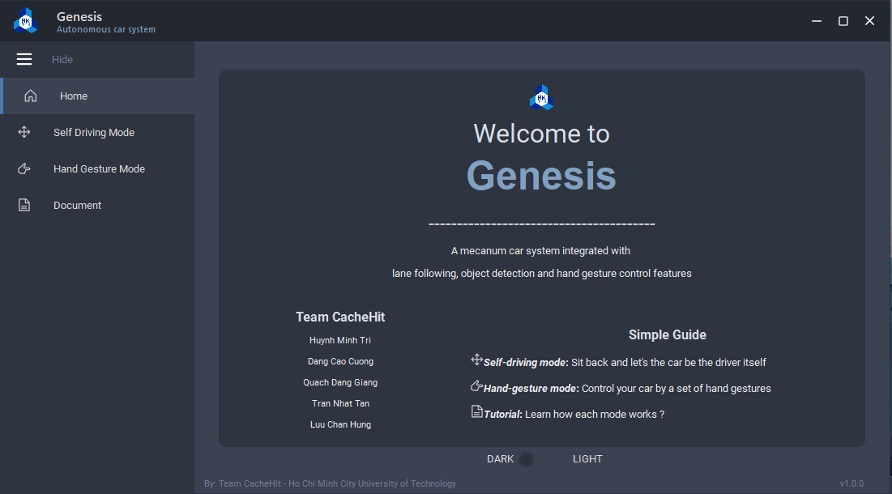
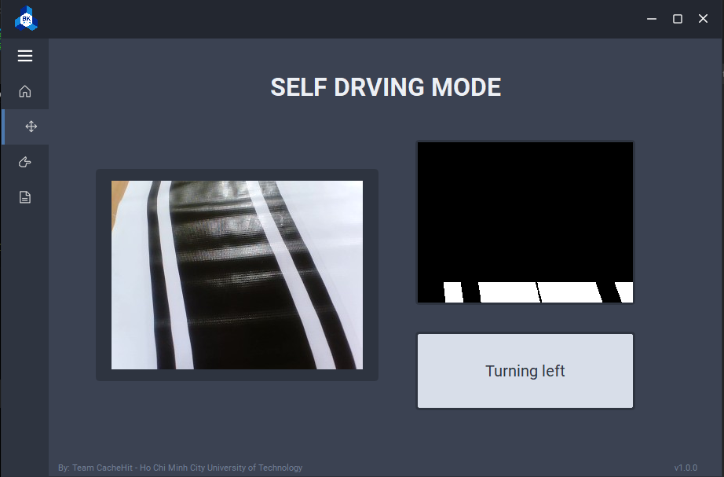
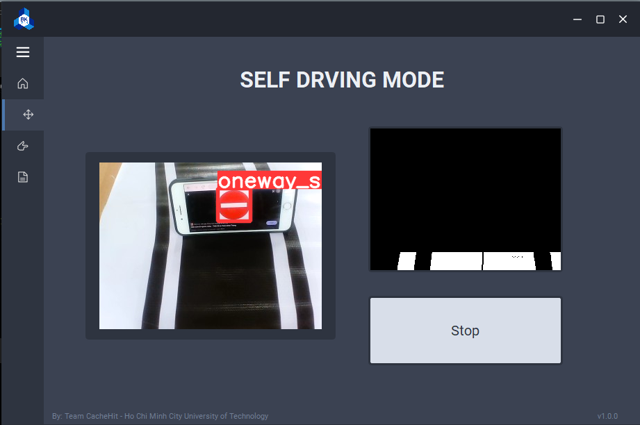
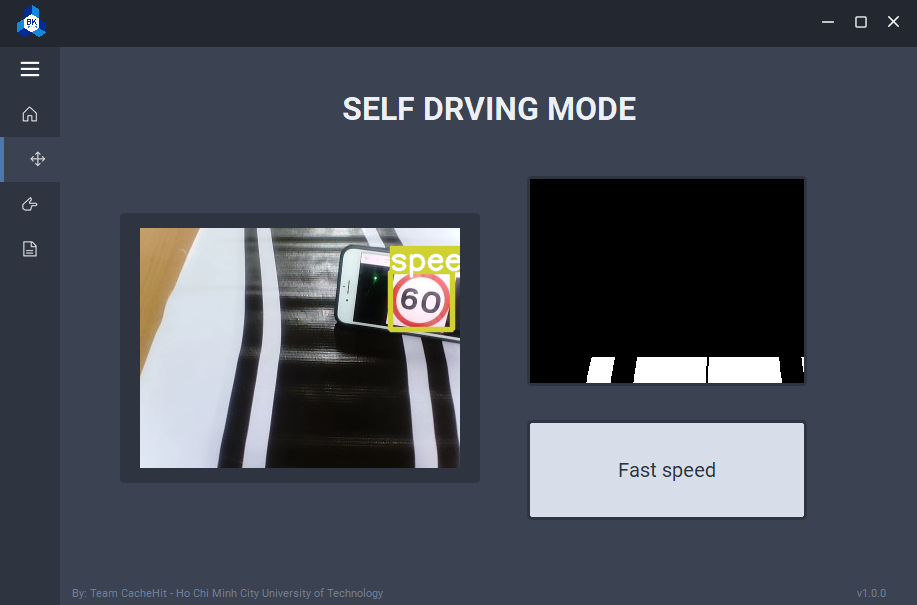
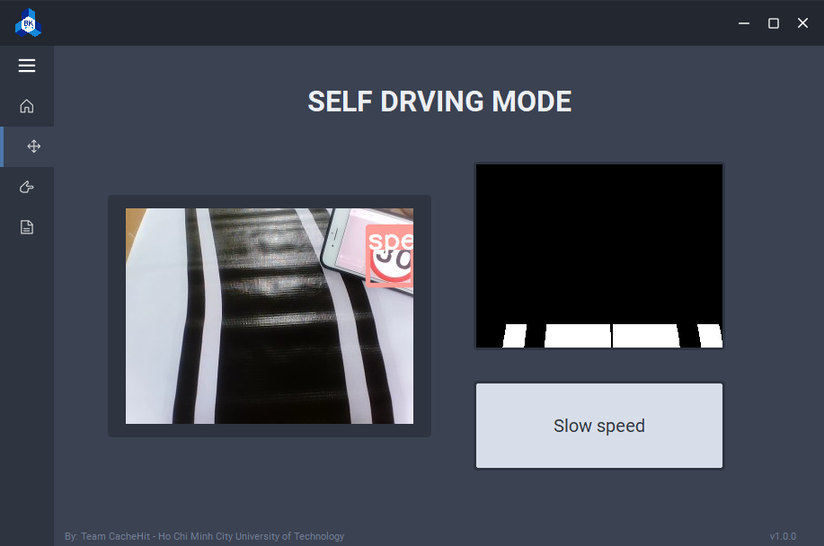

# BK-212-Autonomous Car

> An app leveraging computer vision technology to self-driving car.
> Live demo [Genesis video]().

## Table of Contents
* [Overview](#overview)
* [File Organization](#file-organization-🗄️)
* [About the files](#about-the-files)
* [Setting up environment with Anaconda](#setting-up-environment-with-anaconda)
* [How to run code?](#how-to-run-code)
* [Technologies Used](#technologies-used)
* [Screenshots](#screenshots)
* [Contact](#contact)


## Overview
This project builds a self-driving RC car using Raspberry Pi, microbit and open source software.
There are 2 main mode: Autonomous mode and User Mode. In Autonomous Mode, Raspberry Pi collects inputs from a camera module, and sends data to a computer wirelessly. The computer processes input sensor data for object detection (stop sign, 30 mph sign, 60 mph sign) and lane following. Input image will feed into 2 AI models for recognizing road signs and calculating the steering angle. Predictions are then sent to the Raspberry Pi to control the car. Regarding to User mode, the computer uses its camera to classifying hand gesture, and transmit the correspoding command control to Raspberry Pi for driving the car.

## File Organization 🗄️

```shell
├── BK_212_Autonomous_Car_DMC_Project (Current Directory)
    ├── Helper module
    │   ├── Car Module
    │   ├── Finger Count
    │   ├── Gesture Volume Control
    │   ├── Hand Distance Measurement
    │   ├── lan_connect
    │   └── Motion detection
    ├── code
    │   ├── HandGesture
    │   │   ├── gen_model
    │   │   ├── HandGesture.py
    │   │   ├── helper.py
    │   │   └── lan_connect
    │   │       ├── Client.py
    │   │       └── Server.py
    │   ├── image_receiver.py
    │   ├── image_sender.py
    │   ├── LaneFollowing
    │   │   └── LaneFollowing.py
    │   └── ObjectDetection
    │       ├── best.onnx
    │       ├── classes.txt
    │       ├── ImageProcessing.py
    │       ├── ObjectDetection.py
    │       └── yolov5
    ├── Helper module
    ├── images
    ├── LICENSE
    ├── main.py
    ├── main.ui
    ├── modules
    ├── README.md
    ├── resources.qrc
    ├── setup.py
    ├── themes
    └── widgets       
```
## About the files

* **Helper module/**: used for testing and research.
  * **lan_connect/**: test the lan connection between the server, a controller such as acomputer, and a Raspberry circuit deposited on the car.
  * **Finger Count/**: testing an utility which control the volume of a computer by recognizing hand gestures.
  * **Hand Distance Measurement/**: measure the relative distance from the camera to a detected hand.
  * **Motion detection/**: capture the motion of the cars on a road.
* **code/**
    * **/HandGesture/** 
      `HandGesture.py`: car control with hand gesture.
      `helper.py`: helper functions.
      **lan_connect/**: connect client server between computer and Raspberry.
      **gen_model/**: contain hand gesture models.
    * **LaneFollowing/**
      `LaneFollowing.py`: Calculate steering angle based on image.
    * **ObjectDetection**
      `best.onxx`: Best yolov5n model for object detection.
      `classes.txt`: list of road signs classes.
      `ImageProcessing.py`:
      `ObjectDetection.py`: Object detecion for road signs. 
      **yolov5**: contain yolov5 model.
* **main.py** : Main function to run entire project.
  
## Setting up environment with Anaconda
  1. Install [`miniconda(Python3)`](https://conda.io/miniconda.html) on your computer
  2. Create `auto-car` environment with all necessary libraries for this project
     ```pip install -r requirements.txt```
  3. Activate `auto-car` environment
     ```source activate auto-car```
  
  &ensp; To exit, simply close the terminal window. More info about managing Anaconda environment, please see [here](https://conda.io/docs/user-guide/tasks/manage-environments.html).
  
## How to run code

1. Install [Git](https://git-scm.com/book/en/v2/Getting-Started-Installing-Git).

2. Clone this repository (the main branch) on your computer by this commmand.
```
git clone https://github.com/hungluu6453/BK_212_Autonomous_Car_DMC_Project.git
```
3. Activate `auto-car` environment
```
source activate auto-car
```
4. Run the main project file.
```
python3 main.py
```

## Technologies Used
- Python3
- mediapipe, tensorflow, pytorch
- QtDesigner, PySide6

## Screenshots







## Contact
Created by [@hungluu6453](https://github.com/hungluu6453), [@Proton2001](https://github.com/Pronton2001), [@nhattantran](https://github.com/nhattantran), [@CaptainCuong](https://github.com/CaptainCuong) and [@qdgiang](https://github.com/qdgiang) - feel free to contact us!
